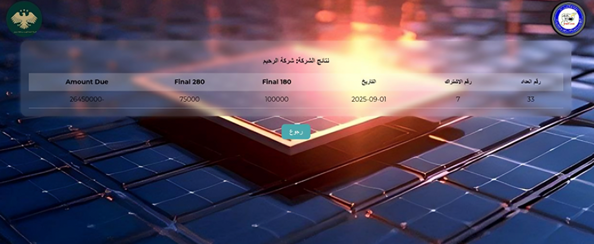
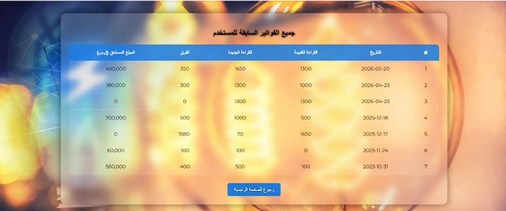
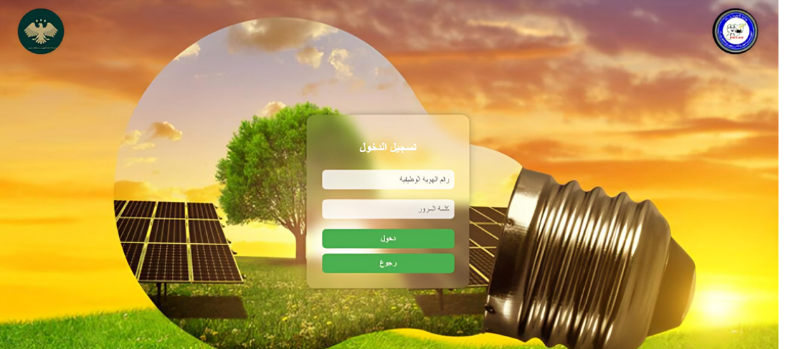
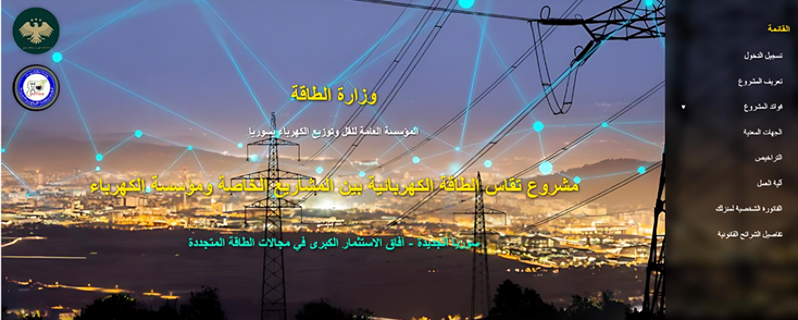
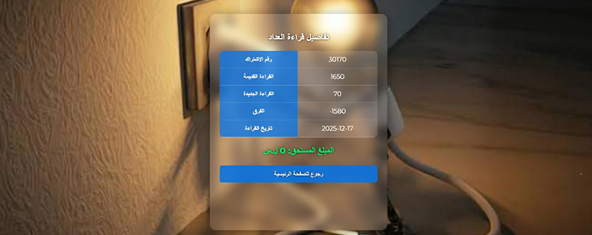

# Energy Consumption Comparison System

## Description
A full-stack web application developed to measure and compare electrical energy consumption between public and private companies.

## Features
- Compare electricity consumption.
- Generate analytical reports.
- User-friendly interface.
- Store and manage data using MySQL.

## Technologies
- PHP
- Laravel
- MySQL
- JavaScript
- HTML5
- CSS3

## My Role
- Designed the database.
- Developed the frontend and backend.
- Implemented CRUD operations.
- Tested and debugged the application.

  
### Home Page

### Login Page

### Dashboard

### Reports

### Comparison

